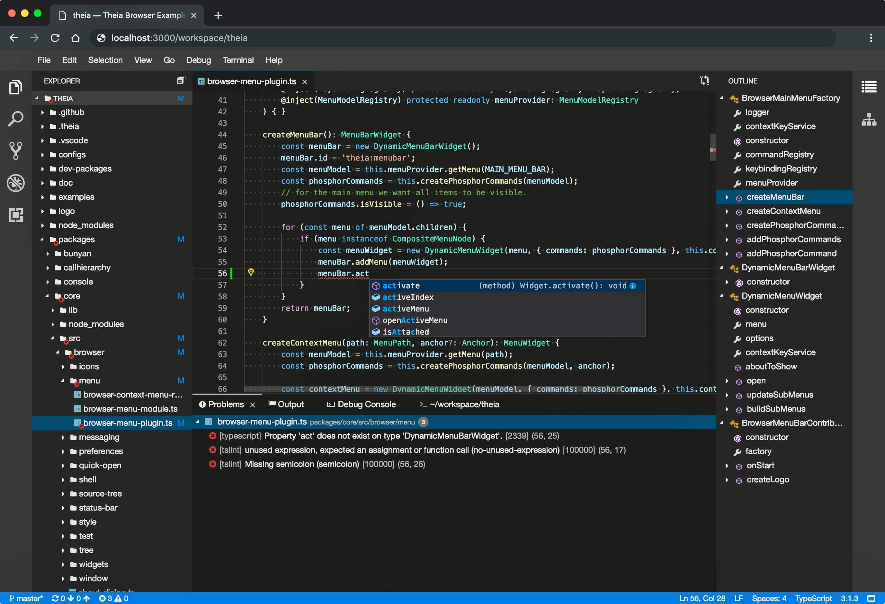
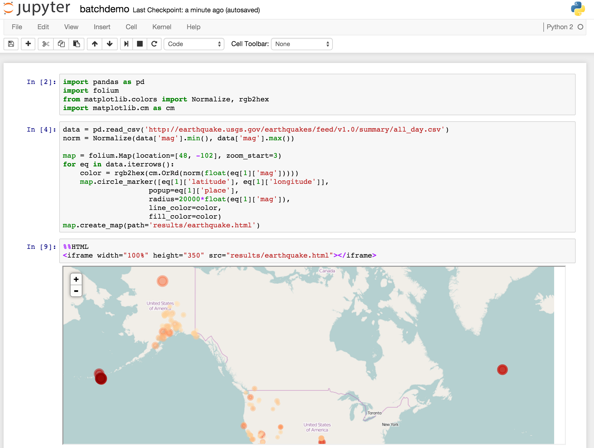
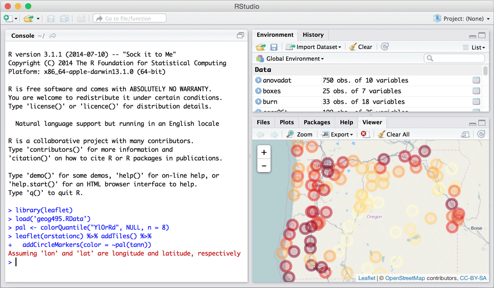

Environments
=================

.. toctree::
   :maxdepth: 2

Environments consist of web-based, containerized interfaces launched on-demand by researchers. Approved environemnts 
and details about them are below. 

Theia Python
-----------------
A rich IDE that allows researchers to manage their files and data, write code with an intelligent editor, and execute 
code within a terminal session.

Jupyter Notebok
----------------------
Allows for interactive, notebook-based analysis of data. A good choice for pulling quick results or refining your code in 
numerous languages including Python, R, Julia, bash, etc.

RStudio
----------------
The standard IDE for research using the R programming language. This environment is useful for generating plots and 
other R-based analysis.

Runtimes & Limitations
--------------------------------------

- Computing environments can be used for short-lived, interactive, computing and analysis.
- Environments may also be used for longer, more intensive job runs that may last for hours. 
- For extended runs, you may close your browser tab and return later, if so desired.
- While environments cannot be "paused" their configuration can easily be repeated.
- Environments are bound to 16 cores / 48GB of memory / 1TB of cluster storage.
- Outbound access to the Internet is restricted to package and library mirrors such as pip, PyPi, CPAN, CRAN, etc.

While ACCORD is not a BYOC (Bring Your Own Container) environment, we welcome your suggestions for additional containers 
to be considered in the future.

